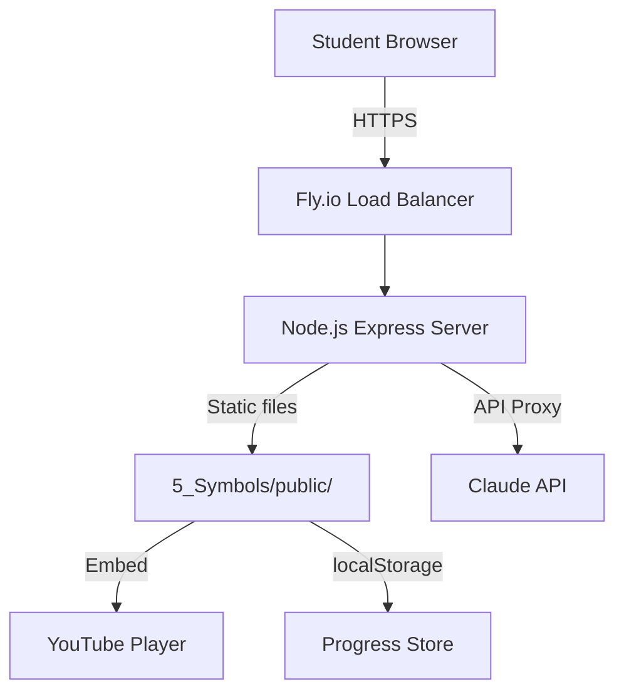
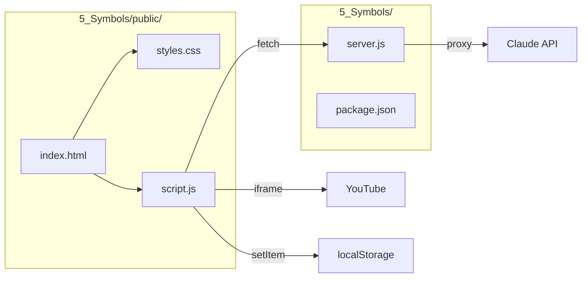

# Architecture

## System Overview



## Component Diagram



## Data Flow

1. **Page Load** → Express serves `index.html` from `5_Symbols/public/`
2. **Lesson Select** → JS loads YouTube embed, updates UI
3. **Progress** → Saved to `localStorage` (client-side)
4. **Chat** → JS sends message to `/api/chat` → Server proxies to Claude API
5. **Response** → Claude response streamed back to chat UI

## File Structure

```
5_Symbols/
├── server.js          # Express backend
├── package.json       # Dependencies
└── public/
    ├── index.html     # Course portal UI
    ├── script.js      # Frontend logic
    └── styles.css     # UI styles
```
